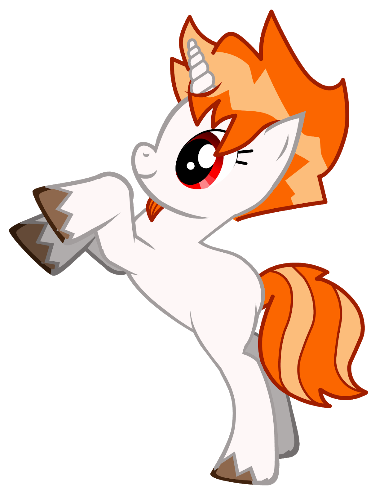
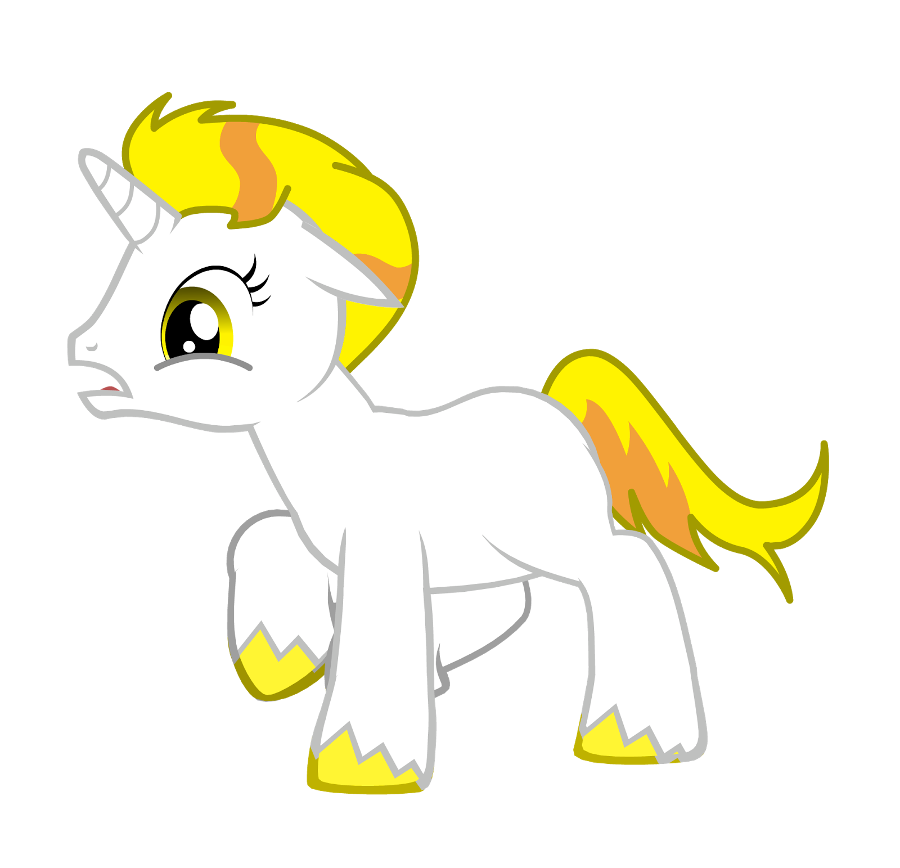
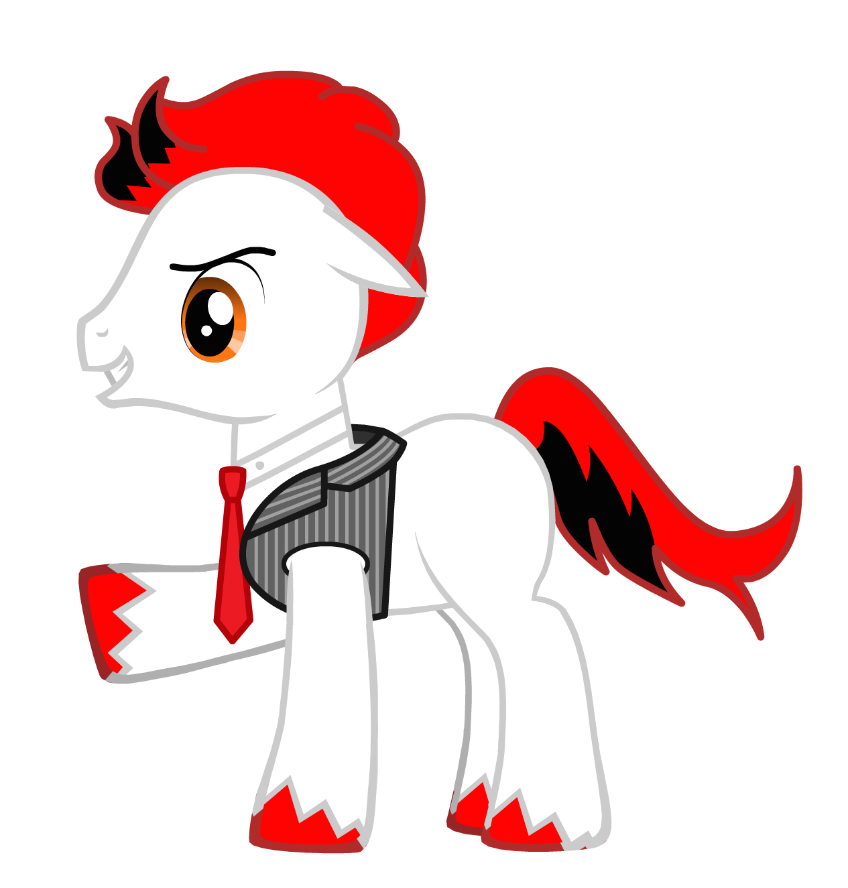
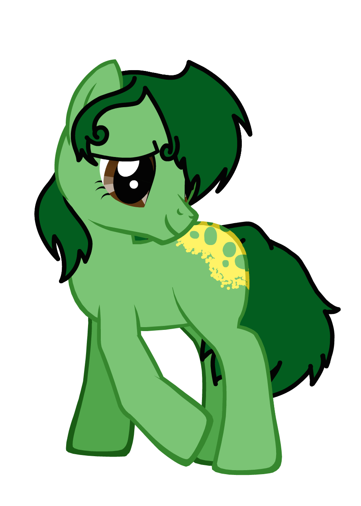
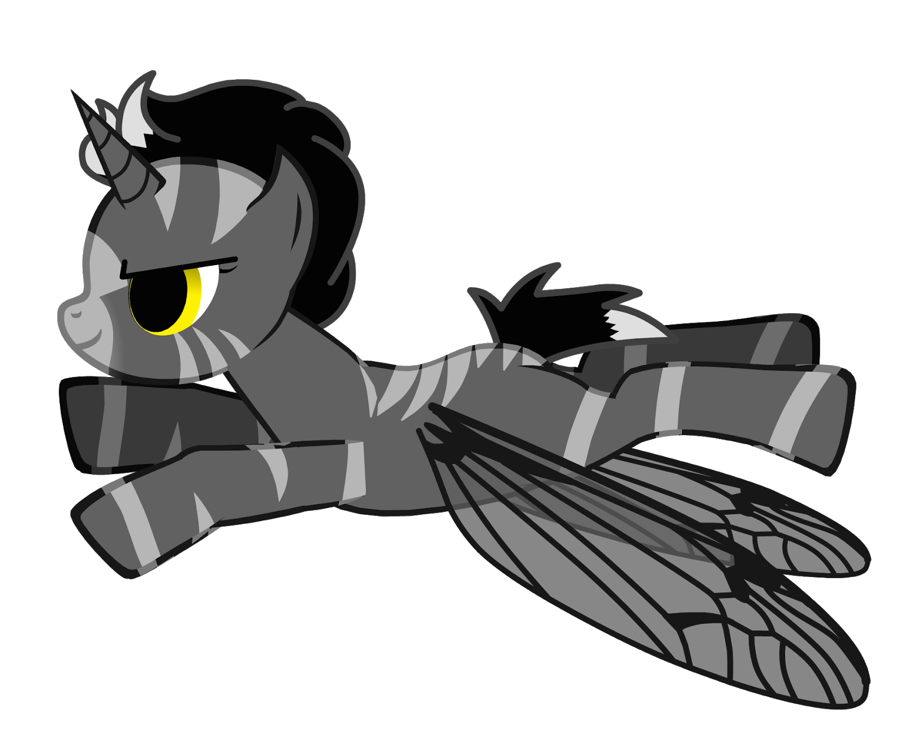

**Ponies created by****[Deirdré Straughan](http://www.beginningwithi.com/)****with an online game:****[General Zoi’s Pony Creator](http://generalzoi.deviantart.com/art/Pony-Creator-Full-Version-254295904)**

This tool creates "pony codes" (a long string of numbers and letters) which can be re-entered to restore the edit session, allowing you to modify the ponies further. Many of these pony codes are included here.

If you use the ponies, please give credit to General Zoi's Pony Creator.

A shirt with many of these ponies can be bought  [here](http://178198.com/presale/detail/i/nixgeek#) (Chinese).

# The Original DTrace Ponycorn

History of the pony mascot:  [http://dtrace.org/blogs/about/dtracepony/](http://dtrace.org/blogs/about/dtracepony/)

# Linux perf\_events (aka the "perf" command)

WH0OP8S////Vp/B8S//80un18378m26Vp/Cvi/y3yVp/C/t//21

000010000351080046247037056304335338334314356314316000

# SystemTap

Inspired by the (official?) "smiley tap" logo, which is yellow with a shouting face:  [http://en.wikipedia.org/wiki/SystemTap](http://en.wikipedia.org/wiki/SystemTap)

WH0SZ8S//////Hd8W//80nk18371m3p//80+wzS3yVp/C/t//23

WH0SZ8S//////Hd8W//80nk18371m3p//80+wzS3yVp/C/t//23

# ktap

Ed0OOPK////YOc98S0Axlok18371m3mx02Cz9h240Vp/C/t//21

# DTrace for Linux - Paul Fox port

2S2S000100FEFEFE997D6B03001FE0000UN183700020000271FE6600FCC46219107F3FCC004CB2

# LTTng

Inspired by the LTTng digging mole mascot:  [http://lttng.org/](http://lttng.org/)

Wg0U00VYOc9/yIT00O3aJ0l18370001////Oc9Y01Vp/C/t//21110000

# Oracle DTrace for Solaris

WJ0SXgC/////m008r/tSMak18371m01/m0000003yVp/C/t//22

# Oracle DTrace for Linux

WJ0SV00/////m008r/tSMak18371m01/m0000003yVp/C/t//2232xHma44Oc9Y

# 

# Linux ftrace

WW0Oi0IVCLs//Hd0FO3aJpn1837003i05uW/t//2jVp/C/t//29

000000000017000336325000000000000000000000000000054000

# Linux eBPF

Inspired by the capabilities of eBPF: fast and "crazy stuff". See slide 5 of  [http://events.linuxfoundation.org/sites/events/files/slides/bpf\\_collabsummit\\_2015feb20.pdf](http://events.linuxfoundation.org/sites/events/files/slides/bpf_collabsummit_2015feb20.pdf)

bQA00iwJqzFjxUt16aoSdqn18373W070000uE3W08Vp/C/t//21

# Bpftrace

1N3X000551FFB3CEFFE7F300001FFA330UL183700000000000FF5F96FF7FFF00107F3FCC004CB2

